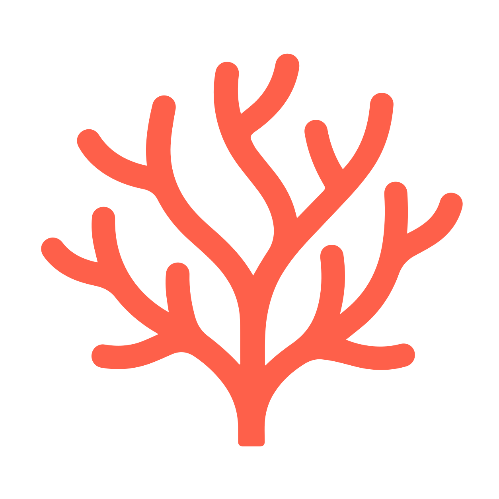

<div align="center">
  

  <h1>GitCoral</h1>

  <p><strong>Explore any GitHub repository as an interactive 3D visualization</strong></p>

  <p>
    Type a repo, watch its file tree bloom into a navigable 3D universe of folders and files.
  </p>

  <p>
    <a href="https://gitcoral.com"><strong>Live Demo →</strong></a> ·
    <a href="https://github.com/moikot/gitcoral/issues">Report Bug</a> ·
    <a href="https://github.com/moikot/gitcoral/issues">Request Feature</a>
  </p>

  <p>
    
    
    
    
    
  </p>
</div>

---

## What is GitCoral?

GitCoral turns a GitHub repository's file tree into a **live 3D point cloud** you can orbit, zoom, and explore in your browser. Each file is a dot, each folder a glowing sphere, and the hierarchy flows upward in layers — like a coral reef growing toward the surface.

Enter any public repo URL, hit **Render**, and in seconds you get an interactive 3D map of its structure — no sign-in, no setup, no backend.

---

## Features

### Visualization
- **3D point cloud** rendered with WebGL via Three.js — folders as spheres, files as orbiting dots
- **Hierarchy layers** — depth encoded on the vertical axis so structure is immediately readable
- **Connectors** — animated lines linking parent folders to their children
- **Orbit controls** — click and drag to rotate, scroll to zoom, right-click to pan
- **Auto-orbit** — one-click continuous rotation; grabbing the canvas stops it instantly

### Color Modes
| Mode | Description |
|------|-------------|
| **By type** | Each file extension gets a unique color — spot your `.ts`, `.py`, `.md` at a glance |
| **By size** | Hotter = larger file; instantly find the heavy files |
| **By depth** | Color encodes how deep in the tree a node lives |

### Filtering & Search
- **Path search** — type a fragment to highlight matching files and dim everything else
- **Extension toggle** — show or hide specific file types with one click
- **File size range** — log-scale slider to focus on files within a size band
- **Depth range** — peel away deep layers to focus on top-level structure

### Layout Controls
Fine-tune the physics of the 3D layout with live sliders:

| Slider | Effect |
|--------|--------|
| **Z scale** | Vertical stretch — push layers further apart |
| **Buoyancy** | Downward pull on folder nodes within a layer |
| **Repulsion** | How strongly folders push each other apart |
| **Spread** | How tightly child folders cluster inside their parent |
| **File sphere size** | Radius of the file point cloud around each folder |

### Sharing & Export
- **Shareable URLs** — camera position, color mode, and search query are encoded in the URL; copy and share to show exactly what you see
- **PNG snapshot** — download a high-resolution screenshot of the current view with one click

### Notes
- Supports `github.com/owner/repo`, SSH URLs, and short `owner/repo` form
- Layout computation runs in a **Web Worker** — the UI stays responsive while big repos are processed
- No authentication needed for public repositories — unauthenticated GitHub API requests are rate-limited to 60/hour per IP; if you hit the limit, wait a minute and try again

---

## Getting Started

### Prerequisites

- [Node.js](https://nodejs.org/) 20+
- [Angular CLI](https://angular.dev/tools/cli) 21+

```bash
npm install -g @angular/cli
```

### Install

```bash
git clone https://github.com/moikot/gitcoral.git
cd gitcoral
npm install
```

### Run locally

```bash
ng serve
```

Open [http://localhost:4200](http://localhost:4200). The app reloads automatically on file changes.

### Build for production

```bash
ng build
```

Output lands in `dist/gitcoral/browser/` — drop it on any static host (GitHub Pages, Netlify, Vercel, Cloudflare Pages, …).

### Run tests

```bash
ng test
```

---

## How It Works

```
GitHub REST API    →    Web Worker      →    Three.js Renderer
(3 API calls)           (3D layout)          (WebGL)
```

1. **Fetch** — three GitHub API calls resolve the default branch, HEAD commit, and full recursive file tree
2. **Build** — the raw tree is assembled into a typed `TreeStructure` with subtree byte totals
3. **Layout** — a Web Worker places every node in 3D space using a physics-inspired algorithm (buoyancy, repulsion, sphere packing)
4. **Render** — Three.js draws files as billboard points via a custom GLSL shader and folders as connector endpoints via `LineSegments2`
5. **Interact** — a screen-space raycast on every pointer move finds the nearest node within a pixel radius for hover and click selection

---

## Contributing

Contributions are welcome! Feel free to open an issue to discuss a feature or bug before sending a PR.

1. Fork the repo
2. Create a branch: `git checkout -b feature/my-feature`
3. Commit your changes: `git commit -m 'Add my feature'`
4. Push: `git push origin feature/my-feature`
5. Open a Pull Request

---

## License

Distributed under the MIT License. See [`LICENSE`](LICENSE) for details.
